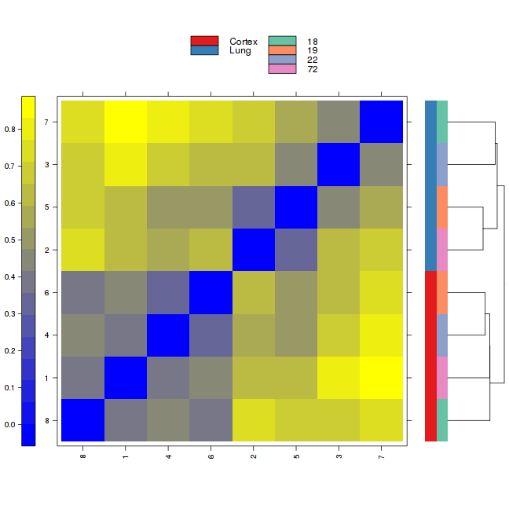
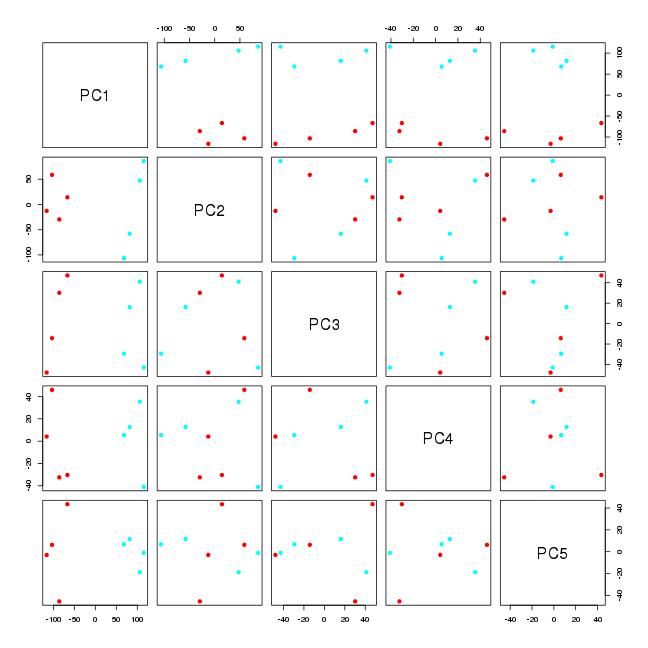
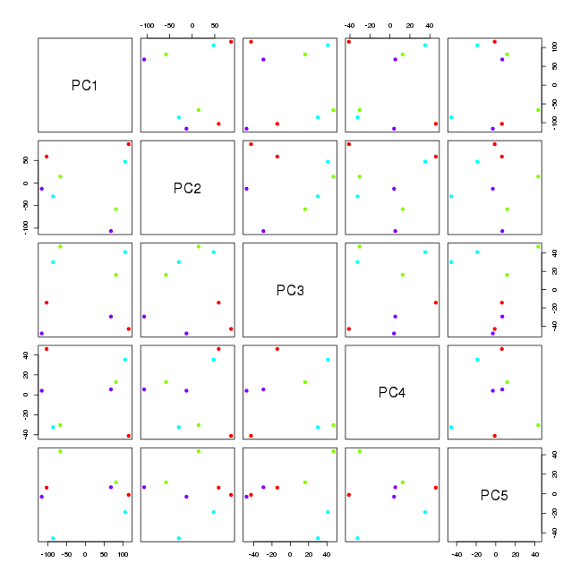
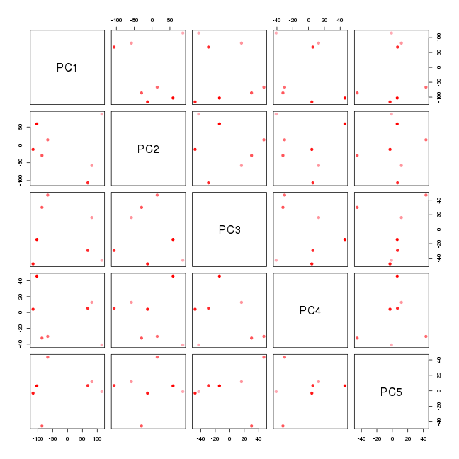
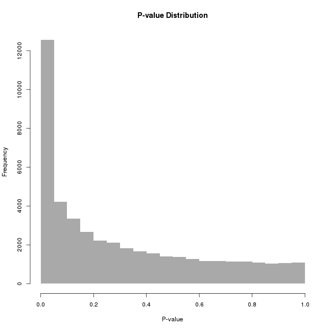
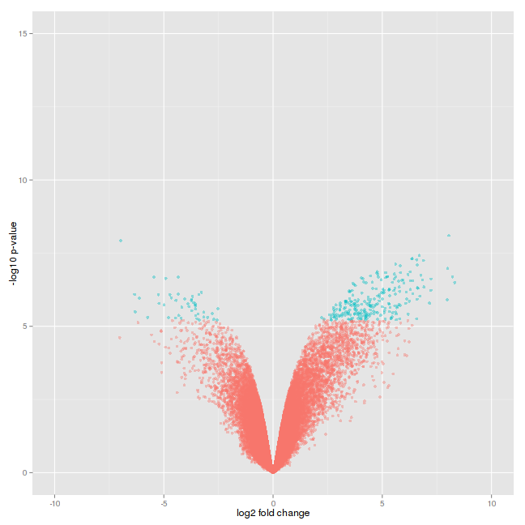
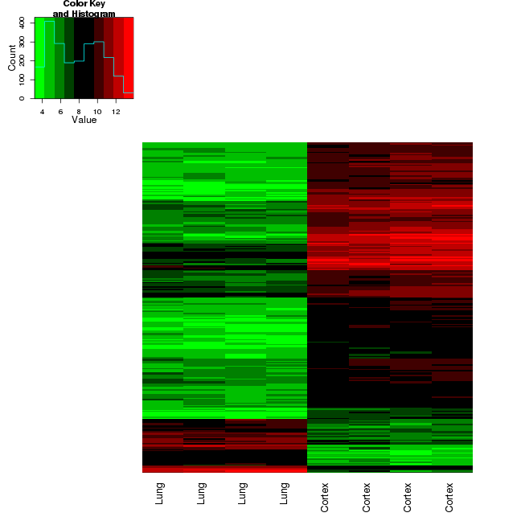
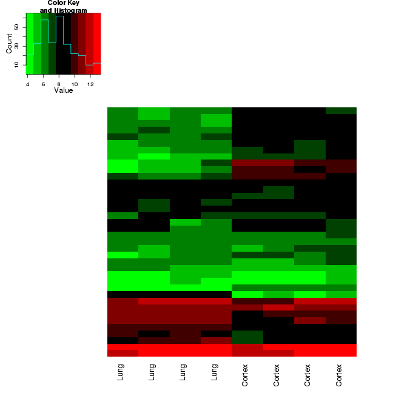

GU- Blood Brain Analysis
========================================================


Array analysis for Ben Andreone (bandreon4119@gmail.com) at Neurobiology at HMS. Contact Meeta Mistry (mmistry@hsph.harvard.edu) for additional details. Request from client was:

Revisit array data comparing gene expression in endothelial cells purified from brain and lung, looking for genes that may be important in the development of the blood brain barrier.

Also, compare the gene expression levels to those from other endothelial cell microarray data sets published in GEO that use the same platform (Affymetrix 430 2.0)


# Bioconductor and R libraries used

```r

library(affy)
library(arrayQualityMetrics)
library(RColorBrewer)
library(simpleaffy)
library(limma)
library(mouse430a2.db)
library(pheatmap)
library(ape)
library(statmod)
library(xtable)
library(plyr)
library(ggplot2)
library(gplots)
```


### Get variables
- get base directory for analyses
- specify data and results directories
- specify column headers used in metadata file


```r
baseDir = getwd()
dataDir = paste(baseDir, "/data", sep = "")
resultsDir = paste(baseDir, "/results", sep = "")
groupid_column_header1 = "Tissue"
groupid_column_header2 = "SampleNumber"
```


Phenotype data was cleaned up with Google Refine (the Refine project can be downloaded at [this link](./results/meta/Gu-dChip_array_summary.google-refine.tar.gz) including a history of all data transformation steps). One row was deleted after the use of Refine

## Load in phenotype data and CEL files
  

```r
mic.data <- read.affy("covars.desc", path = dataDir, verbose = T)
```

```
## 1 reading /home/mistrm82/R/Gu_bloodbrain/data/CG2011101819.CEL ...instantiating an AffyBatch (intensity a 1004004x8 matrix)...done.
## Reading in : /home/mistrm82/R/Gu_bloodbrain/data/CG2011101819.CEL
## Reading in : /home/mistrm82/R/Gu_bloodbrain/data/CG2011101820.CEL
## Reading in : /home/mistrm82/R/Gu_bloodbrain/data/CG2011110401.CEL
## Reading in : /home/mistrm82/R/Gu_bloodbrain/data/CG2011110402.CEL
## Reading in : /home/mistrm82/R/Gu_bloodbrain/data/CG2011110403.CEL
## Reading in : /home/mistrm82/R/Gu_bloodbrain/data/CG2011110404.CEL
## Reading in : /home/mistrm82/R/Gu_bloodbrain/data/CG2011110405.CEL
## Reading in : /home/mistrm82/R/Gu_bloodbrain/data/CG2011110406.CEL
```


## QC report on raw data 


 
[Raw QC](./results/report_raw/index.html)


## Background Correct and Normalize using RMA normalization


```r
mic.edata <- call.exprs(mic.data, "rma")
```

```
## Background correcting
## Normalizing
## Calculating Expression
```


```r

# Extract expression data and factor pheno data
allData <- exprs(mic.edata)
colnames(allData) <- rownames(pData(mic.edata))

pData(mic.edata)[, groupid_column_header1] <- factor(pData(mic.edata)[, groupid_column_header1])
pData(mic.edata)[, groupid_column_header2] <- factor(pData(mic.edata)[, groupid_column_header2])
```


## QC Analysis
Using different methods to identfy outliers - each module can take the raw data or the normalized data.


```r

# Prepare data for AQM
preparedData = prepdata(expressionset = mic.edata, intgroup = c(groupid_column_header1, 
    groupid_column_header2), do.logtransform = F)
preparedAffy = prepaffy(expressionset = mic.data, preparedData)
```


We can compute the number of outliers found from the different methods outlined in the QC report link above.


```r

# Relative Log Expression plots
rle <- aqm.rle(preparedAffy)
rle.out <- rle@outliers@which
if (length(rle.out) > 0) rleoutliers <- names(rle.out)

# Normalized Unscaled Standard Error plots
nuse <- aqm.nuse(preparedAffy)
nuse.out <- nuse@outliers@which
if (length(nuse.out) > 0) nuseoutliers <- names(nuse.out)
```


Above, we have RLE and NUSE plots. These plots.. Based on these QC methods we identify a total of  0 outliers. Next, we use other QC methods for which the input can be either raw data or normalized data, including boxplots, MA plots and a distance heatmap.


```r

# Distance between arrays using heatmap
hm <- aqm.heatmap(preparedAffy)
hm.out <- hm@outliers@which
if (length(hm.out) > 0) hmoutliers <- names(hm.out)  #sample names of outliers

# Boxplots
bo <- aqm.boxplot(preparedAffy, subsample = 10000, outlierMethod = "KS")
bo.out <- bo@outliers@which
if (length(bo.out) > 0) boutliers <- names(bo.out)

# MA plots
ma <- aqm.maplot(preparedAffy)
ma.out <- ma@outliers@which
if (length(ma.out) > 0) moutliers <- names(ma.out)
```


From these methods we find the data is generally good with 0 ouliers found. The heatmap below illustrates this.The color scale is chosen to cover the range of distances encountered in the dataset. Patterns in this plot indicate that the arrays cluster better by tissue type rather than by sample number.




## PCA
Plot all pairwise combinations of the first 5 principal components for the samples
The more similar the samples are, the closer they will cluster in these plots. In the frst one below tissue type is coded by color.




In the second plot the color coding represents the sample number. For each mouse tissue from the cortex and lung was assayed.



In this last plot we investigate whether samples are clustering based on average intensity. Intensity is illustrated using a color scale from red (high intensity) to light pink (low intensity). 




From the PCA plots we see that the first two principal components (along which we see the largest variation in the data) represent tissue differences between samples.We also see PC3 somewhat explained by difference in Sample Number.Its best to use a paired design in limma. 

## Differential Expression Analysis


```r

pData(mic.edata) <- pData(mic.edata)[with(pData(mic.edata), order(Tissue, SampleNumber)), 
    ]
newOrder <- match(rownames(pData(mic.edata)), colnames(exprs(mic.edata)))
exprs(mic.edata) <- exprs(mic.edata)[, as.vector(newOrder)]
```


```r

samples <- cbind(c(1, rep(0, 3), 1, rep(0, 3)), c(0, 1, rep(0, 2), 0, 1, rep(0, 
    2)), c(rep(0, 2), 1, 0, rep(0, 2), 1, 0), c(rep(0, 3), 1, rep(0, 3), 1))
tissue <- cbind(c(rep(1, 4), rep(0, 4)), c(rep(0, 4), rep(1, 4)))
contrast.matrix <- data.frame(cbind(tissue, samples))
colnames(contrast.matrix) <- c("Cortex", "Lung", "Sample18", "Sample19", "Sample22", 
    "Sample72")

mod <- model.matrix(~-1 + Tissue + SampleNumber, pData(mic.edata))

# Fit a linear model
fit <- lmFit(mic.edata, mod)

# Compute estimated coefficients and standard errors for contrasts
contrasts <- makeContrasts(TissueCortex - TissueLung, levels = mod)
fit2 <- contrasts.fit(fit, contrasts)
fit2 <- eBayes(fit2)
```


From this fit, we find 277 genes to be differentially expressed between Cortex and Lung. Threshold applied is fold change greater than 2 AND adjusted p-value < 0.001.


```r
gene_list <- topTable(fit2, coef = 1, number = nrow(exprs(mic.edata)), sort.by = "logFC")

# P-value Distribution
hist(gene_list$P.Value, col = "darkgrey", border = F, xlab = "P-value", main = "P-value Distribution")
```




```r
# Highlight genes Bonferroni
gene_list$threshold.B = as.factor(abs(gene_list$logFC) > 2 & gene_list$P.Value < 
    0.05/nrow(gene_list))
# FDR
gene_list$threshold.FDR = as.factor(abs(gene_list$logFC) > 2 & gene_list$adj.P.Val < 
    0.001)

## Construct the plot object
ggplot(data = gene_list, aes(x = logFC, y = -log10(P.Value), colour = threshold.FDR)) + 
    geom_point(alpha = 0.4, size = 1.75) + opts(legend.position = "none") + 
    xlim(c(-10, 10)) + ylim(c(0, 15)) + xlab("log2 fold change") + ylab("-log10 p-value")
```



```r

top <- gene_list[which(as.logical(gene_list$threshold.FDR)), ]
```


Plot a heat map of the top 277 significant genes to see changes in gene expression.


```r
top.edata <- exprs(mic.edata)[rownames(top), ]

heatmap.2(top.edata, dendrogram = "none", trace = "none", col = greenred(10), 
    labRow = "", labCol = pData(mic.edata)$Tissue)
```




The Gu lab previously identfied a top list of 38 probes. None of these probes appear in our top list, although if we reduce the stringency by increasing p-value cutoff to padj < 0.01 we get 15 of their probes. A heatmap of the 38 probes depicted below. 


```r
gu.genes <- read.delim("Gu_orginal_list.csv", header = T, sep = "\t", row.names = 1, 
    as.is = T)
length(which(rownames(gu.genes) %in% row.names(top)))
```

```
## [1] 0
```

```r

gu.edata <- exprs(mic.edata)[rownames(gu.genes), ]


heatmap.2(gu.edata, dendrogram = "none", trace = "none", col = greenred(10), 
    labRow = "", labCol = pData(mic.edata)$Tissue)
```




